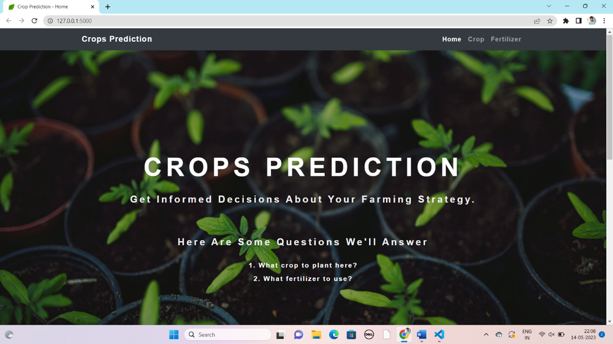
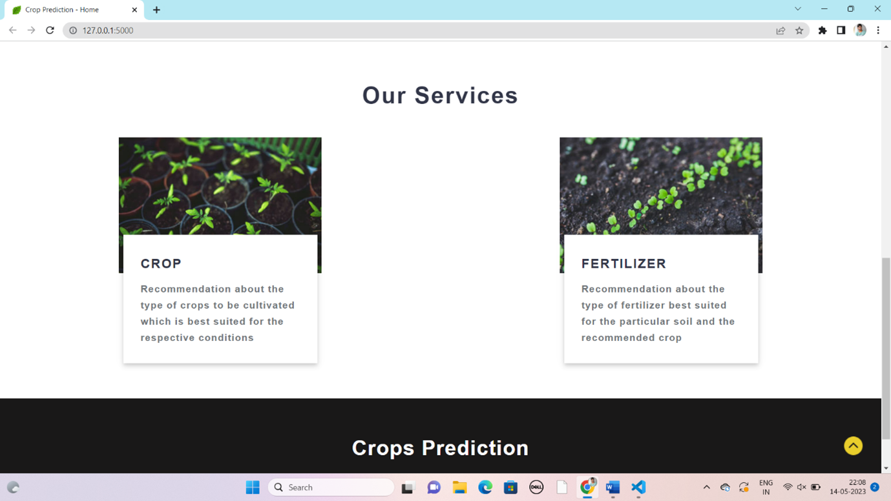
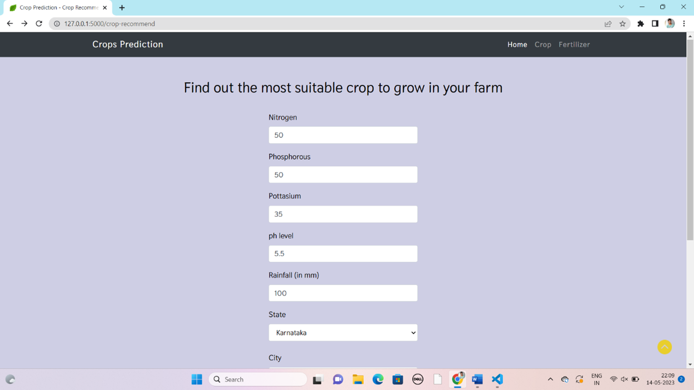
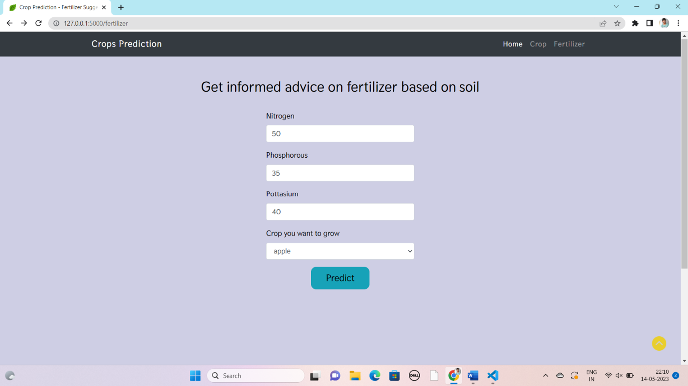

# Crop-Prediction 🌿
#### A simple  machine learning-based system that recommends the best crop to grow and suitable fertilizers based on environmental and soil conditions..

## MOTIVATION 💪
Agriculture is a crucial sector for economic growth, especially in countries like India where a significant portion of the population depends on farming for their livelihood.

With the integration of technologies like Machine Learning and Deep Learning, farming practices are becoming more efficient, helping farmers optimize crop yields and enhance productivity.

- This project features a website with two key applications: 

    - Crop Recommendation: Users input soil data, and the application predicts the most suitable crop to grow. 
    
    - Fertilizer Recommendation: The app suggests appropriate fertilizers based on the soil data and crop type to improve soil health and boost crop growth.

## How to use 💻
- Crop Recommendation system ==> enter the corresponding nutrient values of your soil, state and city. Note that, the N-P-K (Nitrogen-Phosphorous-Pottasium) values to be entered should be the ratio between them. 

- Fertilizer suggestion system ==> Enter the nutrient contents of your soil and the crop you want to grow. The algorithm will tell which nutrient the soil has excess of or lacks. Accordingly, it will give suggestions for buying fertilizers.

<details>
  <summary>Supported crops
</summary>

- Apple
- Blueberry
- Cherry
- Corn
- Grape
- Pepper
- Orange
- Peach
- Potato
- Soybean
- Strawberry
- Tomato
- Squash
- Raspberry
</details>

## Images
### Home


### About


### Crop


### Crop result


### Fertilizer


### Fertilizer result


## How to Run Locally 🚀

To run this project locally on your machine, follow these steps:


### 1. Clone the Repository

Clone the repository to your local machine using the following command:

```bash
git clone https://github.com/chinthaginjalabhuvan/crop-prediction.git
```
### 2. Set Up the Environment

Once the project is cloned, open **Anaconda Prompt** in the directory where the project was cloned . Alternatively, you can use Google Colab to set up the environment for the project by uploading the necessary files or linking the GitHub repository directly in your Colab environment.

### 3. Run the Application

Run the project with:

```bash
python app.py
```
### 4.Access the Application

Open the localhost url provided after running `app.py` and now you can use the project locally in your web browser.

## Crop Prediction Report

[Download PDF](https://github.com/ChinthaginjalaBhuvan/crop-prediction/blob/pro%20-%2027%20%2C%20CSE%20copy%20github%20version.pdf)


   

